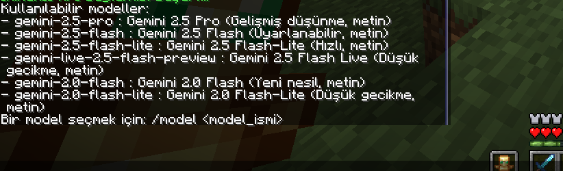

<div align="center">


<h1>🤖 MineAI - Minecraft PaperMC 1.21.8 AI Sohbet Eklentisi</h1>

<strong>🚀 Google AI Studio (Gemini) API ile entegre, oyun içi yapay zeka sohbet deneyimi!</strong>

</div>

<div align="center">


</div>


---

## 🖼️ Oyun İçi Komutlar ve Ekran Görüntüleri

### Yardım Komutu
```
/aihelp
```
Oyun içi yardım ve komut listesini gösterir.


---

### API Anahtarı Tanımlama
```
/api <API_ANAHTARINIZ>
```
Google AI Studio'dan ücretsiz API anahtarı alıp buraya girin. Bağlantı testi otomatik yapılır.


---

### Model Seçimi
```
/model
/model <model_ismi>
```
Kullanılabilir Gemini modellerini listeler veya seçer.



---

### Yapay Zeka ile Sohbet
```
/ai <mesajınız>
```
Yapay zeka ile sohbet başlatır. Yanıtlar arasında ayırıcı çizgi bulunur.


---

## 🎯 Özellikler
- Google AI Studio (Gemini) API ile tam entegre
- Kişiye özel API anahtarı ve model seçimi
- Sohbet geçmişi desteği
- Oyun içi yardım ve hata mesajları
- Yanıtlar arasında ayırıcı çizgi ile okunaklı sohbet

## ⚡ Hızlı Başlangıç
1. [Google AI Studio](https://aistudio.google.com/app/apikey) adresinden ücretsiz API anahtarınızı alın.
2. `mineai-1.0.5.jar` dosyasını sunucunuzun `plugins` klasörüne atın.
3. Sunucunuzu yeniden başlatın veya `/reload` komutunu kullanın.
4. Oyun içinde `/api <anahtar>` ile anahtarınızı girin.
5. `/model` ile model seçin veya varsayılanı kullanın.
6. `/ai <mesaj>` ile yapay zeka ile konuşmaya başlayın!

---

## 📁 Proje Yapısı
- `github/codes/` – Tüm kaynak kodları
- `github/images/` – Oyun içi ekran görüntüleri
- `github/mineai-1.0.5.jar` – Derlenmiş plugin dosyası

## 📝 Lisans
MIT Lisansı ile açık kaynak.

<div align="center">

<em>MineAI ile Minecraft sunucunuzda yapay zeka deneyimini başlatın!</em>

</div>
